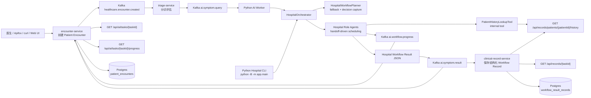
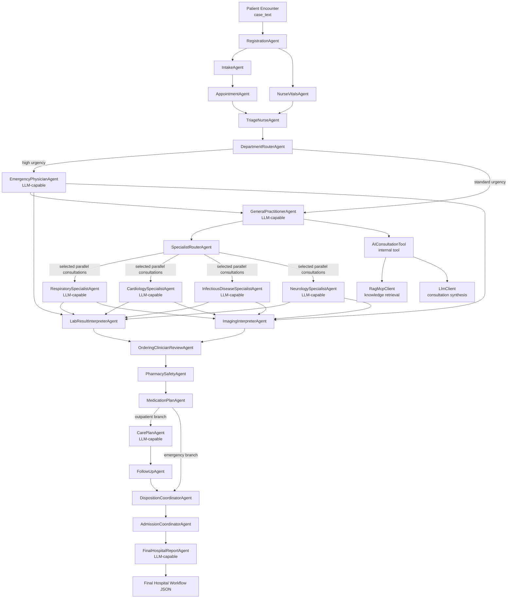

# Healthcare Agent Hospital-lite

这是一个 healthcare 主题的多 agent + 微服务 demo。当前目标是构建一个可展示的完整业务链路：Spring Boot 多模块后端创建就诊任务，triage-service 完成分诊并触发 AI workflow，Python AI worker 执行 Agent Hospital workflow，最终返回可查询的 workflow result，并由 clinical-record-service 归档结构化记录。Patient Encounter 和 Workflow Record 使用 Docker Postgres 持久化，方便后续前端反复查询和展示流程。

## 文档入口

- [业务流程说明](docs/BUSINESS_FLOW.md)
- [组会讲解稿](docs/MEETING_GUIDE.md)
- [Current demo guide](docs/CURRENT_DEMO_GUIDE.md)
- [项目领域词汇](CONTEXT.md)
- [Agent 上下文说明](docs/agents/domain.md)

## 完整 Demo 链路



## Branched Agent Hospital-lite Workflow



Specialist agents selected by `SpecialistRouterAgent` run as parallel consultations once the shared upstream context is available. The main workflow is scheduled from each agent's `handoff_to` output; `HospitalWorkflowPlanner` now acts as a fallback and workflow-decision capture boundary instead of forcing a fixed route.

Workflow output includes `handoff_timeline` as the main display contract for the multi-agent workflow. It records administrative, triage, routing, order, clinical interpretation, medication, disposition, admission, handoff, specialist parallel fan-out, fan-in, `tool_invoked`, and `tool_skipped` events so the UI can render the workflow without reverse-engineering raw agent results.

Internal tools are grouped behind `ClinicalToolRegistry` so role agents can choose whether to use them during their own decisions. Current demo tools include `PatientHistoryLookupTool`, `GuidelineLookupTool`, `LabResultFetchTool`, `ImagingResultFetchTool`, `MedicationInteractionTool`, `BedAvailabilityTool`, `ReferralSchedulingTool`, `FollowUpSchedulingTool`, `HumanReviewRequestTool`, `CareCoordinationTool`, `EmergencyEncounterTool`, `PractitionerAssignmentTool`, `ResourceReservationTool`, and `ExamSchedulingTool`. Tool outcomes are emitted into the handoff timeline as `tool_invoked` or `tool_skipped`, and service failures such as an unavailable care-coordination service are represented as unavailable tool results instead of crashing the workflow. `LabAdvisorAgent` and `DiagnosticOrderAgent` remain in the codebase for earlier/alternate hospital-lite experiments, but the current default path pauses them and uses the ordering-clinician review loop instead.

`AdmissionCoordinatorAgent` can call `CareCoordinationTool`, which posts to `care-coordination-service` and records the resulting follow-up, referral, admission, and human-review plan in the agent timeline.

While the workflow is running, the Python AI worker publishes Realtime Agent Progress events to `ai.workflow.progress`. The encounter service stores these events so the frontend can poll the timeline before the final workflow record is available.

## 目录结构

```text
backend/                          Kotlin Spring Boot 多模块后端
backend/common-proto/             后续 gRPC 协议
backend/encounter-service/        REST 入口，创建任务，发布 Patient Encounter 事件
backend/triage-service/           分诊服务，消费 encounter event 并发布 AI workflow task
backend/clinical-record-service/  临床记录服务，消费 workflow result 并保存结构化记录
backend/care-coordination-service/照护协调服务，生成随访、转诊、住院和人工审核安排
frontend/                         Vue/Vite 医疗工作台前端
app/agents/                       医院角色 agent
app/tools/                        agent 内部工具
app/workflows/                    HospitalOrchestrator 和 HospitalWorkflowPlanner
app/worker/                       Python Kafka worker
infra/                            Kafka + Postgres docker compose
outputs/                          本地运行输出，默认不提交
```

## 运行 Python Agent Workflow

```powershell
python -B -m app.main `
  --case-text "fever, cough, chest discomfort and confusion" `
  --patient-id p001 `
  --doctor-id d001 `
  --output outputs\hospital_mock_demo.json `
  --mock-llm `
  --print-json
```

## Spring Boot + Kafka 链路

启动 Kafka 和 Postgres：

```powershell
docker compose -f infra\docker-compose.kafka.yml up -d
```

默认数据库连接：

```text
jdbc:postgresql://localhost:5432/healthcare
user / password
```

启动 Python worker：

```powershell
python -B -m app.worker.kafka_worker --bootstrap-servers 127.0.0.1:9092
```

For ER surge demos, start the worker with concurrent task processing so multiple patient encounters can compete for practitioner and resource capacity at the same time:

```powershell
python -B -m app.worker.kafka_worker `
  --bootstrap-servers 127.0.0.1:9092 `
  --concurrency 4
```

在 IDEA 中分别启动这些 Spring Boot Application，或使用 Maven 命令启动：

批量启动/停止 Spring Boot 服务：

```powershell
.\scripts\start-healthcare-services.ps1
.\scripts\start-healthcare-services.ps1 -CoreOnly
.\scripts\start-healthcare-services.ps1 -Verify
.\scripts\verify-healthcare-services.ps1 -CoreOnly
.\scripts\stop-healthcare-services.ps1
```

`start-healthcare-services.ps1` 会把服务日志写入 `outputs\service-logs`，并把进程信息写入 `outputs\healthcare-services.pids.json`。默认启动核心服务和 ER 演示服务；`-CoreOnly` 只启动 `encounter-service`、`triage-service`、`clinical-record-service`、`care-coordination-service`；`-Verify` 会在启动后调用 `scripts\verify-healthcare-services.ps1`，并自动传递同一个 `-CoreOnly` 模式。

启动 encounter-service：

```powershell
cd backend
mvn -pl encounter-service spring-boot:run
```

启动 triage-service：

```powershell
cd backend
mvn -pl triage-service spring-boot:run
```

启动 clinical-record-service：

```powershell
cd backend
mvn -pl clinical-record-service spring-boot:run
```

启动 care-coordination-service：

```powershell
cd backend
mvn -pl care-coordination-service spring-boot:run
```

创建任务：

```powershell
curl -X POST http://localhost:8081/api/ai/symptom-query `
  -H "Content-Type: application/json" `
  -d "{\"caseText\":\"A 67-year-old male has fever, productive cough, chest discomfort and confusion.\",\"question\":\"Run hospital consultation workflow\",\"doctorId\":\"d001\",\"patientId\":\"p001\",\"language\":\"zh-CN\"}"
```

查询结果：

```powershell
curl http://localhost:8081/api/ai/tasks/{taskId}
curl http://localhost:8083/api/records/{taskId}
```

一键演示脚本：

```powershell
python -B scripts\demo_healthcare_flow.py `
  --base-url http://localhost:8081 `
  --record-base-url http://localhost:8083 `
  --output outputs\demo_healthcare_flow.json
```

## 后端服务接口

encounter-service：

```text
POST http://localhost:8081/api/ai/symptom-query
GET  http://localhost:8081/api/ai/tasks/{taskId}
GET  http://localhost:8081/api/ai/tasks/{taskId}/progress
GET  http://localhost:8081/api/ai/tasks
```

triage-service：

```text
POST http://localhost:8082/api/triage/assess
GET  http://localhost:8082/api/triage/health
```

Kafka 事件：

```text
encounter-service -> healthcare.encounter.created -> triage-service
triage-service    -> ai.symptom.query              -> Python AI worker
Python AI worker  -> ai.workflow.progress          -> encounter-service
Python AI worker  -> ai.symptom.result             -> encounter-service status update
Python AI worker  -> ai.symptom.result             -> clinical-record-service
```

跨服务 Kafka JSON 消息按 topic schema 反序列化，不依赖 Spring Java 类型头。新增服务时保持 `spring.json.add.type.headers: false` 和 `spring.json.use.type.headers: false`，避免不同服务包名下的消息类互相无法反序列化。

clinical-record-service：

```text
POST http://localhost:8083/api/records/workflow-results
GET  http://localhost:8083/api/records/{taskId}
GET  http://localhost:8083/api/records/patients/{patientId}/history
GET  http://localhost:8083/api/records/health
```

The encounter service persists `patient_encounters` and realtime `workflow_progress_events`. It treats `ai.symptom.result` as a status update only: `/api/ai/tasks/{taskId}` returns the Patient Encounter task state, not the full workflow result JSON. The clinical record service persists the complete `workflow_result_records`, including `patientId`, `executed_path`, `workflow_decisions`, `handoff_timeline`, `care_pathway`, `ai_consultation`, `final_report`, and raw workflow result for workflow display. It also exposes a Patient History Summary by `patientId`, so hospital role agents can actively call `PatientHistoryLookupTool` for prior encounters, allergies, current medications, previous dispositions, and final-report excerpts during the next workflow.

care-coordination-service:

```text
POST http://localhost:8084/api/care/coordination-plans
GET  http://localhost:8084/health
```

`POST /api/care/coordination-plans` accepts task, patient, disposition, triage urgency, selected specialties, and monitoring plan fields. It returns `followUpActions`, `referralActions`, `admissionActions`, and `humanReviewRequired` so later workflows can move disposition work out of the Python agent layer.

Emergency Room microservices:

```text
POST http://localhost:8088/api/emergency/encounters
POST http://localhost:8088/api/emergency/encounters/readiness
GET  http://localhost:8088/health

POST http://localhost:8085/api/practitioners/emergency-assignments
GET  http://localhost:8085/health

POST http://localhost:8086/api/resources/emergency-reservations
GET  http://localhost:8086/health

POST http://localhost:8087/api/schedules/emergency-exams
GET  http://localhost:8087/health
```

The Emergency Room minimal demonstrator front-loads microservice use in high-urgency workflows. `EmergencyPhysicianAgent` opens an emergency encounter, requests practitioner assignment, reserves constrained emergency resources, writes readiness back to the emergency encounter, and creates stat exam scheduling before downstream review. Specialist agents can also schedule specialty-specific exams; exam results are expected to return to the ordering clinician for review. `LabAdvisorAgent` and `DiagnosticOrderAgent` remain available for the broader hospital-lite workflow but are not the only model for the new emergency-room loop.

`practitioner-service` and `resource-service` now use Postgres-backed demo scheduling state. `practitioner-service` persists on-shift practitioners, specialties, active assignment counts, and `practitioner_assignments`. `resource-service` persists emergency resource inventory and `resource_reservations`. Both services use transactional reservation logic and expose release endpoints for repeated manual surge demos:

```text
POST http://localhost:8085/api/practitioners/emergency-assignments/{taskId}/release
POST http://localhost:8086/api/resources/emergency-reservations/{taskId}/release
```

Ordering clinician review loop:

```text
EmergencyPhysicianAgent / SpecialistAgent
  -> ExamSchedulingTool
  -> LabResultInterpreterAgent + ImagingInterpreterAgent
  -> OrderingClinicianReviewAgent
  -> PharmacySafetyAgent
```

This matches the demo intent of initial assessment -> exams -> clinician review of results before medication and disposition. It keeps the old lab-advisor and diagnostic-order agents as reusable code but removes them from the current default workflow path.

Emergency surge frontend demo:

The Vue workbench includes an `Emergency Surge Scenario` panel. It submits several real `/api/ai/symptom-query` requests concurrently using the ER demo case, then polls each created task and reads the final clinical record for `resource_reservation` readiness and `practitioner_assignment` staffing. When `resource-service` or `practitioner-service` capacity is exhausted, completed tasks can show `ready`, `partial`, `unavailable`, `assigned`, or `partial` states in the surge panel and in the workflow graph tool nodes. Use `--concurrency 4` on the Python worker when testing ER surge so queued Kafka tasks are processed concurrently instead of one at a time.

## Vue 前端工作台

前端使用 Vite dev proxy 转发请求，不需要额外配置 Spring CORS。请先启动 Kafka/Postgres、需要演示的 Spring Boot 服务和 Python worker；完整 ER 演示会额外用到 emergency-encounter、practitioner、resource、scheduling 四个服务。

```powershell
cd frontend
npm install
npm run dev
```

默认打开：

```text
http://127.0.0.1:5173
```

前端支持创建 Patient Encounter、轮询任务状态、展示 realtime agent progress、展示 agent handoff timeline、查看 Patient History、clinical record 和 final report。`HospitalJourneyOverview.vue` 负责整体医院流程进度，`WorkflowDisplayPanel.vue` 负责 timeline/path/graph 区域编排，`AgentTimeline.vue` 负责实时 agent timeline 渲染，`AgentWorkflowGraph.vue` 使用 Vue Flow 展示本次真实 workflow 覆盖图：高亮实线表示实际走过的 agent handoff，虚线表示未触发分支，边标签表示 agent 决策，`Tool nodes` 开关用于查看 tool 调用、跳过和 unavailable。`ClinicalRecordPane.vue` 负责 Patient History、Clinical Record、Final Report 和 Record JSON 展示，并会把历史报告中的结构化 JSON 摘要转换为可读 Markdown。

## 自动化测试

```powershell
python -B -m pytest
```
