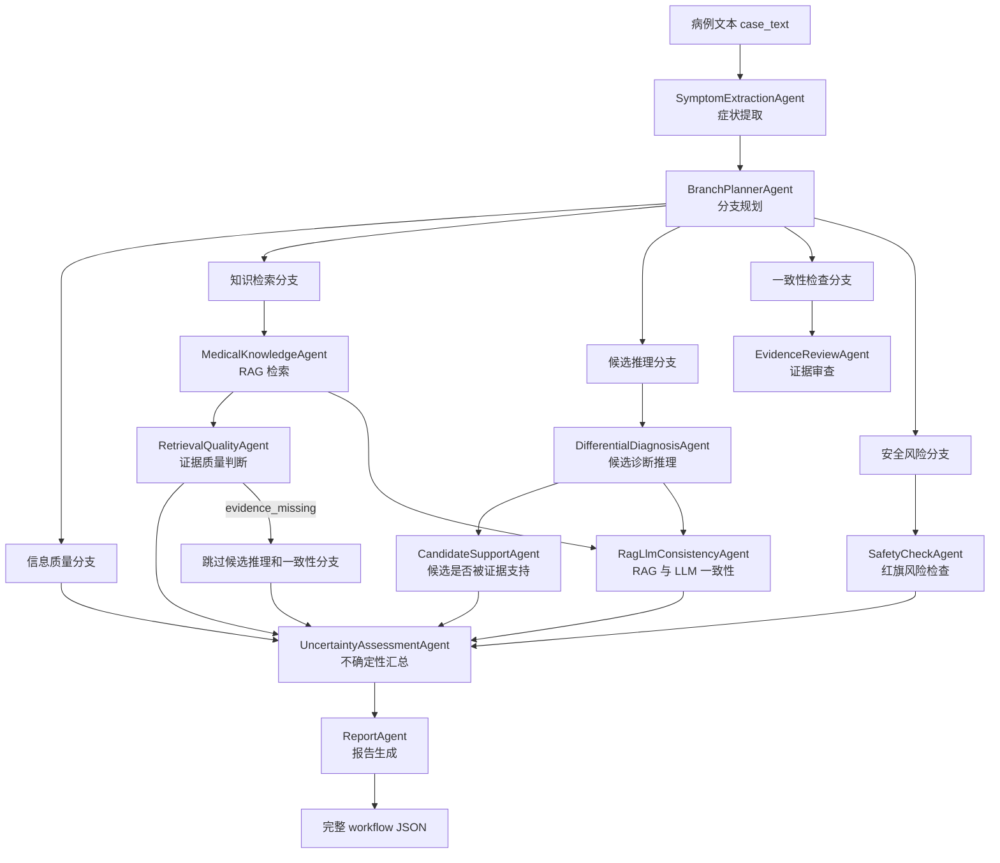

# Healthcare 多智能体不确定性建模项目

本项目是一个 healthcare 主题的多智能体样例系统。它不是自动诊断系统，目标是研究 multi-agent workflow 中的业务不确定性，并把这些不确定性显式记录下来，方便后续基于 PSUM 或 model-based testing 生成测试用例。

当前系统有两条主线：

- **真实流程 demo**：使用本地 RAG 数据和真实 LLM API，运行完整多智能体分析流程。
- **Mock scenario 测试**：使用固定 JSON 控制 RAG 和 LLM agent 输出，不调用真实 LLM，用于稳定触发不确定性。

## 当前 Workflow



当前显式建模的不确定性类型：

- `incomplete_input`：输入信息不足。
- `missing_evidence`：没有检索到可用证据。
- `weak_evidence`：检索证据较弱。
- `unsupported_candidate`：LLM 候选结果没有被 RAG 证据支持。
- `agent_conflict`：RAG 证据和 LLM 候选结果冲突。
- `urgent_risk`：规则检测到紧急风险。
- `branch_skipped`：某些 workflow 分支被跳过。

## 目录结构

```text
app/                    Python 多智能体流程
app/agents/             各个 agent 的实现
backend/                Kotlin Spring Boot 后端
data/                   本地疾病-症状小知识库
docs/                   架构、业务流程和 agent 说明
infra/                  Kafka docker compose
mcp_servers/            本地 RAG 检索服务
scripts/                数据准备和 scenario 工具脚本
tests/                  自动化测试
tests/scenarios/        可执行 mock scenario 数据
outputs/                本地运行结果，默认不提交
```

## 环境准备

```powershell
conda activate healthcare
pip install -r requirements.txt
Copy-Item .env.example .env
```

`.env` 中常用配置：

```text
LLM_API_KEY=你的 API Key
LLM_BASE_URL=https://api.deepseek.com
LLM_MODEL=deepseek-chat
LLM_TIMEOUT_SECONDS=60
MEDICAL_KNOWLEDGE_BASE=E:\study\university 5.2\healthcare\data\health_knowledge_graph.json
```

## 用法一：真实完整流程 Demo

这个命令会运行真实 workflow。只要 `.env` 中配置了 `LLM_API_KEY`，流程中的 LLM agent 会真实调用 LLM。

```powershell
python -B -m app.main `
    --case-text "fever, cough, chest discomfort" `
    --question "What diseases should be considered?" `
    --output outputs\real_demo.json
```

查看结果：

- 终端会显示每个 agent 的执行状态。
- 完整 JSON 会写入 `outputs\real_demo.json`。
- 重点看 `uncertainty_assessment_agent.data.uncertainties`。

如果只想看完整 JSON，也可以加：

```powershell
--print-json
```

## 用法二：FastAPI Demo

启动 Python API：

```powershell
uvicorn app.main:api --reload
```

健康检查：

```powershell
curl http://127.0.0.1:8000/health
```

调用分析接口：

```powershell
curl -X POST http://127.0.0.1:8000/analyze `
  -H "Content-Type: application/json" `
  -d "{\"case_text\":\"fever, cough, chest discomfort\",\"question\":\"What diseases should be considered?\",\"patient_id\":\"p001\",\"doctor_id\":\"d001\",\"language\":\"zh-CN\"}"
```

## 用法三：Kafka + Worker + Spring Boot 完整链路

启动 Kafka：

```powershell
docker compose -f infra\docker-compose.kafka.yml up -d
```

启动 Python AI Worker：

```powershell
python -B -m app.worker.kafka_worker --bootstrap-servers 127.0.0.1:9092
```

启动 Kotlin Spring Boot 后端：

```powershell
cd backend
mvn spring-boot:run
```

创建 AI 任务：

```powershell
curl -X POST http://localhost:8080/api/ai/symptom-query `
  -H "Content-Type: application/json" `
  -d "{\"caseText\":\"A 67-year-old male has fever, productive cough, shortness of breath and confusion.\",\"question\":\"What diseases should be considered?\",\"doctorId\":\"d001\",\"patientId\":\"p001\",\"language\":\"zh-CN\"}"
```

查询任务结果：

```powershell
curl http://localhost:8080/api/ai/tasks/{taskId}
```

任务状态大致为：

```text
RECEIVED -> PUBLISHED -> COMPLETED
```

## 用法四：不经过 Kafka 的 Worker Demo

这个方式适合检查 worker 输入输出格式：

```powershell
python -B -m app.worker.kafka_worker `
    --once-file examples\symptom_task.json `
    --output outputs\worker_once_result.json
```

## 用法五：手工 Mock Scenario 测试

手工 mock scenario 不调用真实 LLM。它通过 JSON 固定：

- 病例输入 `case_text`
- RAG 检索结果 `mock_rag_documents`
- LLM agent 输出 `mock_llm_output`
- 期望触发的不确定性 `expected_uncertainties`

运行一个手工 mock 例子：

```powershell
python -B scripts\run_uncertainty_scenario.py `
    --scenarios tests\scenarios\healthcare_uncertainty_scenarios.json `
    --scenario weak_evidence_unsupported_candidate_demo `
    --output outputs\weak_evidence_unsupported_candidate_demo.json
```

这个例子会稳定触发：

```text
weak_evidence
agent_conflict
unsupported_candidate
```

## 用法六：批量运行 Scenario

运行手工维护的 scenario 集合：

```powershell
python -B scripts\run_uncertainty_scenario.py `
    --scenarios tests\scenarios\healthcare_uncertainty_scenarios.json `
    --all `
    --summary-output outputs\manual_scenario_summary.json
```

运行 LLM-assisted mock 数据集合：

```powershell
python -B scripts\run_uncertainty_scenario.py `
    --scenarios tests\scenarios\llm_generated_cases.json `
    --all `
    --summary-output outputs\llm_generated_summary.json
```

注意：`llm_generated_cases.json` 是保留样例数据，不要删除。

## 用法七：生成 Mock Scenario

用本地 mock response 文件生成一个 scenario：

```powershell
python -B scripts\generate_mock_scenario.py `
    --uncertainty-type agent_conflict `
    --output tests\scenarios\generated_healthcare_uncertainty_scenarios.test.json `
    --mock-response-file tests\scenarios\mock_llm_agent_conflict_response.json `
    --replace
```

批量生成：

```powershell
python -B scripts\generate_mock_scenario.py `
    --uncertainty-types agent_conflict,unsupported_candidate `
    --count 3 `
    --output tests\scenarios\generated_many_uncertainty_scenarios.test.json `
    --mock-response-file tests\scenarios\mock_llm_agent_conflict_response.json `
    --replace
```

## 如何看测试结果

单场景完整输出里重点看这些字段：

```text
retrieval_quality_agent.data.evidence_state
candidate_support_agent.data.candidate_support_state
rag_llm_consistency_agent.data.consistency_state
safety_check_agent.data.red_flags
uncertainty_assessment_agent.data.uncertainties
```

判断关系：

- `evidence_missing` -> `missing_evidence`
- `evidence_weak` -> `weak_evidence`
- `candidate_support_state = unsupported` -> `unsupported_candidate`
- `consistency_state = conflicting` -> `agent_conflict`
- `red_flags` 非空 -> `urgent_risk`

## 自动化测试

运行全部测试：

```powershell
python -B -m pytest
```

主要测试文件：

- `tests/test_workflow_uncertainties.py`：真实 orchestrator 的分支和不确定性行为。
- `tests/test_uncertainty_scenario_runner.py`：手工 scenario 是否触发期望不确定性。
- `tests/test_uncertainty_cli.py`：CLI 是否能运行、汇总和写文件。
- `tests/test_mock_scenario_generator.py`：mock scenario 生成逻辑。

## 重要说明

- Scenario runner 是 mock-only 回放工具，批量测试时不应该调用真实 LLM。
- LLM 可以辅助生成 mock 数据，但生成结果要先保存成 JSON，再作为可重复测试输入。
- `outputs/` 和 `tests/scenarios/*.test.json` 是本地生成物，默认不提交。
