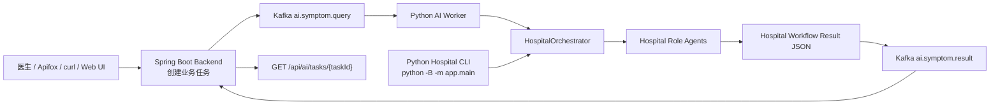
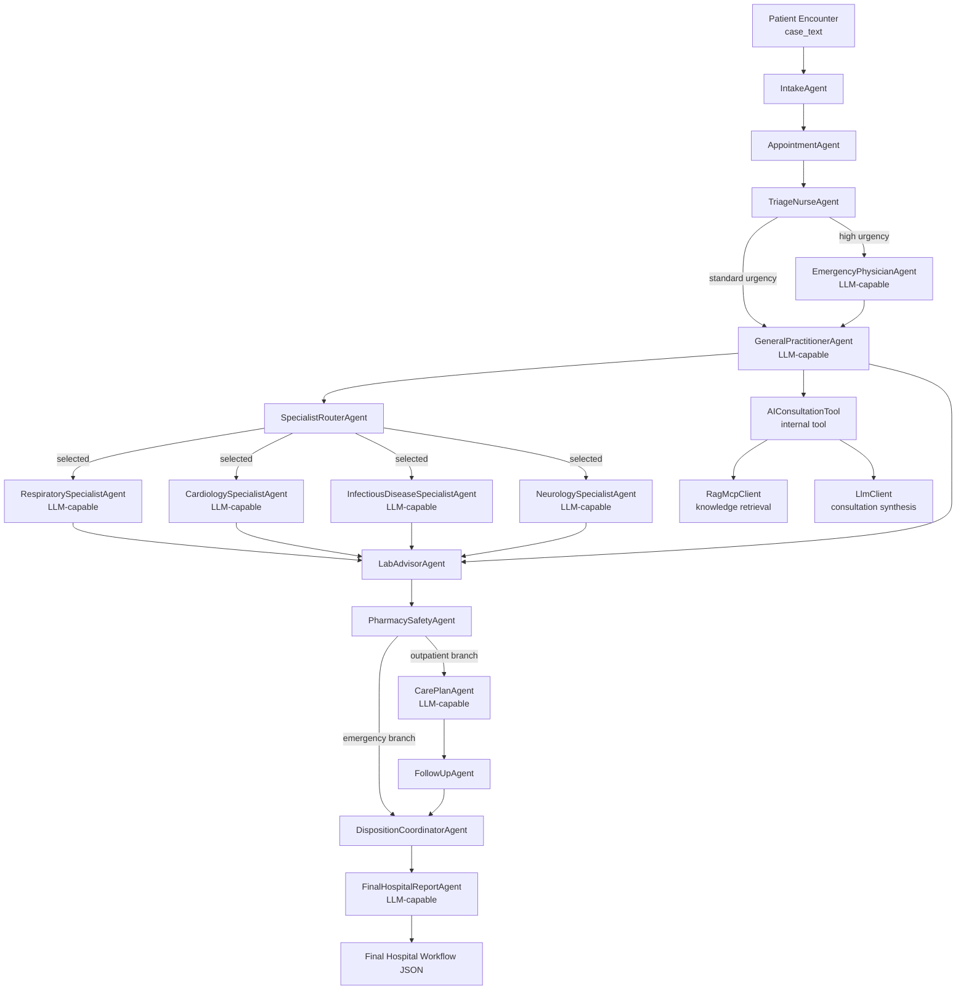

# Healthcare Agent Hospital-lite

这是一个 healthcare 主题的多 agent 业务流程 demo。当前重点不是做真实临床诊断系统，而是构建一个可以展示的完整医院服务链路：患者就诊、预约分流、护士分诊、全科初评、专科会诊、AI 咨询工具调用、检查建议、用药安全、诊疗计划、随访和最终报告。

## 文档入口

- [业务流程说明](docs/BUSINESS_FLOW.md)
- [项目领域词汇](CONTEXT.md)
- [Agent 上下文说明](docs/agents/domain.md)

## 完整 Demo 链路



## Branched Agent Hospital-lite Workflow



Workflow 输出包含 `executed_path` 和 `workflow_decisions`，用于展示本次 Patient Encounter 实际走过哪些医院角色 agent，以及分诊和专科路由为什么选择这些分支。

## 目录结构

```text
app/agents/       医院角色 agent，只放顶层业务角色
app/tools/        agent 内部可调用的工具，例如 AIConsultationTool
app/workflows/    工作流编排，例如 HospitalOrchestrator
app/worker/       Kafka worker
backend/          Kotlin Spring Boot 后端
data/             本地疾病-症状小知识库
infra/            Kafka docker compose
outputs/          本地运行输出，默认不提交
```

## 运行 Hospital Workflow

使用 mock LLM，适合快速展示和自动化测试：

```powershell
python -B -m app.main `
  --case-text "fever, cough, chest discomfort and confusion" `
  --patient-id p001 `
  --doctor-id d001 `
  --output outputs\hospital_mock_demo.json `
  --mock-llm `
  --print-json
```

使用真实 LLM：

```powershell
python -B -m app.main `
  --case-text "67-year-old male with fever, productive cough, chest discomfort and confusion." `
  --patient-id p001 `
  --doctor-id d001 `
  --output outputs\hospital_demo.json `
  --print-json
```

## Spring Boot + Kafka 链路

启动 Kafka：

```powershell
docker compose -f infra\docker-compose.kafka.yml up -d
```

启动 Python worker：

```powershell
python -B -m app.worker.kafka_worker --bootstrap-servers 127.0.0.1:9092
```

启动 Spring Boot backend：

```powershell
cd backend
mvn spring-boot:run
```

创建任务：

```powershell
curl -X POST http://localhost:8080/api/ai/symptom-query `
  -H "Content-Type: application/json" `
  -d "{\"caseText\":\"A 67-year-old male has fever, productive cough, chest discomfort and confusion.\",\"question\":\"Run hospital consultation workflow\",\"doctorId\":\"d001\",\"patientId\":\"p001\",\"language\":\"zh-CN\"}"
```

查询结果：

```powershell
curl http://localhost:8080/api/ai/tasks/{taskId}
```

## 自动化测试

```powershell
python -B -m pytest
```

当前核心测试：

```text
tests/test_hospital_orchestrator.py
tests/test_readme_workflow_diagrams.py
```
